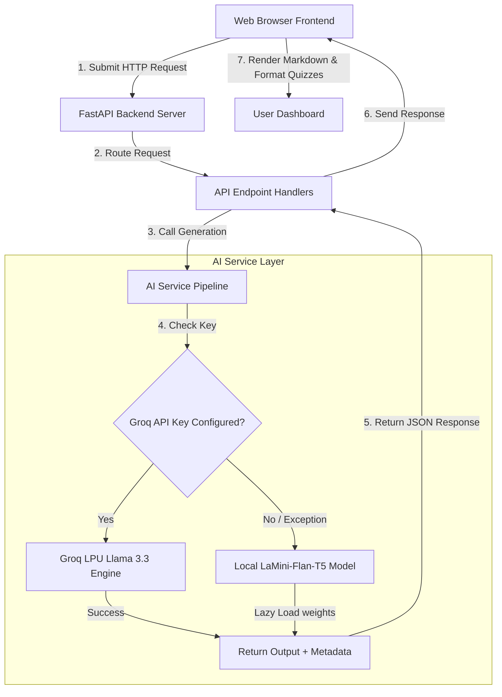

# Phase 3: Project Design Phase 🎨

This phase explains the system architecture, flow patterns, and file structure design of the EduGenie application.

---

## 1. System Flow Architecture

---

## 2. Component Design Breakdown

- **Web Frontend Component**: Standard HTML5, CSS Grid/Flexbox layout, and JavaScript. Uses `marked.js` library for client-side markdown compiling.
- **FastAPI Routing Layer**: Pydantic request models ensure input length constraints and data types are verified. 
- **Configuration Module**: Uses `python-dotenv` to securely inject configurations from a local `.env` file into application runtime environment variables.
- **AI Pipeline Module**: Manages dual-generation logic. Isolates PyTorch execution environments and applies repetition penalties and length constraints.
